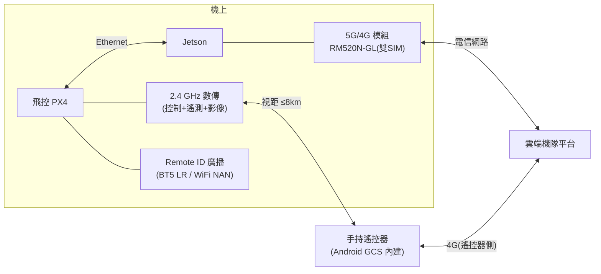

# 10-5 通訊鏈路

## 1. 鏈路架構

**雙鏈路互備**:視距作業以 2.4 GHz 數傳為主(低延遲);BVLOS/超距時 4G/5G 為主。兩鏈路同時在線,MAVLink 路由層(機上 mavlink-router / 自研路由)依延遲與丟包自動選路;全斷觸發失聯返航。

## 2. 2.4 GHz 數傳(主鏈路)

| 項目 | 規格 |
|------|------|
| 方案 | 整合式數位圖傳+遙控+遙測(候選:自研 SDR 級 or 現成模組 SIYI/Herelink 級 OEM) |
| 距離 | ≥ 8 km(FCC 功率,開闊無干擾) |
| 影像 | 1080p/30,端到端 < 250 ms |
| 跳頻/加密 | FHSS + AES-256 |
| 階段策略 | Phase 0–1 用現成模組(Herelink/SIYI MK32 級);Phase 2 評估自研或 ODM 客製(降本 + 頻段合規客製) |

自研數傳是高風險項目(射頻人才/認證),**不排入關鍵路徑**;以 OEM 客製達成品牌與頻段需求即可。

## 3. 4G/5G(BVLOS 鏈路)

- 模組:Quectel RM520N-GL(5G Sub-6,全球頻段,M.2 接 Jetson)
- 雙 SIM 雙電信備援;台灣另評估專頻(如遙控無人機專用實驗頻段)
- 流量:遙測 < 10 MB/h;影像 720p 上雲約 1 GB/h(可調)
- 安全:機-雲全程 mTLS + WireGuard 隧道;SIM 綁定裝置
- 延遲預算:5G 下 100–200 ms,滿足監控與指令;**控制迴路永不依賴此鏈路**(機上自主為前提)

## 4. Remote ID

- 三區都已強制或即將強制:美國 FAA Remote ID(2023 起)、歐盟 Direct RID(C1 以上)、台灣跟進中
- 方案:獨立廣播模組(Bluetooth 5 Long Range + WiFi NAN 雙模,候選:Dronetag OEM / 自製 ESP32-S3 方案),由飛控餵航跡
- 設計即內建(標準件、佔位、供電),原型階段可不啟用

## 5. 頻段與認證備註(設計前置)

| 區域 | 2.4 GHz 數傳 | 蜂窩 | 型式認證 |
|------|--------------|------|----------|
| 台灣 | NCC 低功率電波輻射性電機(LP0002),EIRP 限制 | 電信終端設備審驗 | NCC 型式認證 |
| 美國 | FCC Part 15.247 | PTCRB(模組已預認證) | FCC ID |
| 歐盟 | RED 2014/53/EU,EN 300 328 | CE(RED) | CE + DoC |

- 選用**已預認證的射頻模組**(蜂窩模組、RID 模組)可大幅縮短整機認證
- 天線佈局在結構設計初期就定位(GNSS 天線遠離圖傳、蜂窩;詳見結構文件)

## 6. 遙控器(地面端)

- Phase 0–1:採用數傳配套遙控器(Android 系統),安裝我們的 GCS App
- Phase 2:客製外殼與按鍵配置的 ODM 遙控器(7" 高亮屏、熱插拔電池、IP54)
- 遙控器同時具 4G:現場無數傳訊號時可經雲端中繼控制(延遲較高,限任務級指令)
