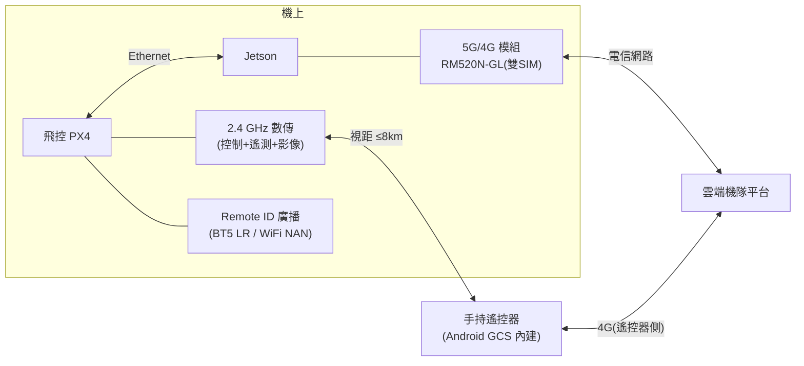

# 10-5 通訊鏈路

## 1. 鏈路架構

**雙鏈路互備**:視距作業以 2.4 GHz 數傳為主(低延遲);BVLOS/超距時 4G/5G 為主。兩鏈路同時在線,MAVLink 路由層(機上 mavlink-router / 自研路由)依延遲與丟包自動選路;全斷觸發失聯返航。

## 2. 2.4 GHz 數傳(主鏈路)

| 項目 | 規格 |
|------|------|
| 方案 | 整合式數位圖傳+遙控+遙測(候選:自研 SDR 級 or 現成模組 SIYI/Herelink 級 OEM) |
| 距離 | ≥ 8 km(FCC 功率,開闊無干擾) |
| 影像 | 1080p/30,端到端 < 250 ms |
| 跳頻/加密 | FHSS + AES-256 |
| 階段策略 | Phase 0–1 用現成模組(Herelink/SIYI MK32 級);Phase 2 評估自研或 ODM 客製(降本 + 頻段合規客製) |

自研數傳是高風險項目(射頻人才/認證),**不排入關鍵路徑**;以 OEM 客製達成品牌與頻段需求即可。

## 3. 4G/5G(BVLOS 鏈路)

- 模組:Quectel RM520N-GL(5G Sub-6,全球頻段,M.2 接 Jetson)
- 雙 SIM 雙電信備援;台灣另評估專頻(如遙控無人機專用實驗頻段)
- 流量:遙測 < 10 MB/h;影像 720p 上雲約 1 GB/h(可調)
- 安全:機-雲全程 mTLS + WireGuard 隧道;SIM 綁定裝置
- 延遲預算:5G 下 100–200 ms,滿足監控與指令;**控制迴路永不依賴此鏈路**(機上自主為前提)

## 4. Remote ID

- 三區都已強制或即將強制:美國 FAA Remote ID(2023 起)、歐盟 Direct RID(C1 以上)、台灣跟進中
- 方案:獨立廣播模組,由飛控餵航跡;**2026-07-11 選型定案 Dronetag DRI(OEM),替代料 BlueMark db201**,決策見 §4.1
- 制式口徑修正:法規上 BT5 Long Range 或 WiFi NAN **任一即合規**(FAA 已接受 BT4+BT5 LR 併發組合;EU EN 4709-002 同樣接受 BT 或 WiFi 任一)。原「BT5 LR + WiFi NAN 雙模」表述改為「**BT5 LR 必備、WiFi NAN 可選加分**」——定案件 DRI 為 BT4 Legacy + BT5 LR(無 WiFi),替代料 db201 為 BT + WiFi NAN/Beacon 全制式,若日後市場要求 WiFi NAN 則切換替代料,腳位/佔位相容性見 §4.1
- 設計即內建(標準件、佔位、供電),原型階段可不啟用

### 4.1 Remote ID 模組選型決策(2026-07-11 定案)

**需求基線**(選型輸入):

| 軸 | 要求 | 依據 |
|----|------|------|
| 美國合規 | ASTM F3411-22a 訊息格式 + F3586-22 MoC;整機以 Standard Remote ID 送 FAA DoC | 14 CFR Part 89(2026-07 查核,送件前以最新版覆核) |
| 歐盟合規 | Direct RID,EN 4709-002(EU 2019/945 C 類標配) | 同上 |
| 介面 | MAVLink serial 或 DroneCAN,由 FC-H7(PX4)餵航跡;或獨立自帶 GNSS | §1 架構 |
| 重量 | ≤ 20 g(含天線/線材),對 [propulsion §3](propulsion.md)「5G + Remote ID + 天線 0.06 kg」合列口徑 | bom L16 註 a |
| 供電 | 機上母線降壓後 5 V 或寬壓直入,功耗 mW 級 | system-architecture 功耗表 |

**候選評選表**(市售規格/DoC 列名狀態/單價**均需查證最新規格**,截至 2026-07-11 公開資料):

| 候選 | FAA RID DoC 列名 | EU Direct RID | 介面 | 重量 | 供電 | 單價(NTD 估) | 交期估 | 判定 |
|------|------------------|---------------|------|------|------|----------------|--------|------|
| **Dronetag DRI(OEM)** | 已列名(FAA 初始接受模組之一;需查證現行 uasdoc 狀態) | 依 EN 4709-002 設計 | UART MAVLink 2(2× JST GH 6-pin,由 FC 餵航跡,無自帶 GNSS) | **1.5 g**(含 JST;裸板 0.5 g) | 3.3–17 V 寬壓,均值 3 mA | ~1,900(US$59/€49)+ 天線線材 | 現貨–4 週 | ✅ **定案** |
| **BlueMark db201** | 製造商整合後自送 DoC(db 系列 F3586-22 已過 Cox Data Labs 外審,證據可重用;需查證) | NavCert(EU 公告機構)外審 | UART MAVLink + **DroneCAN ×2**;BT4/BT5 LR + WiFi NAN/Beacon 全制式 | ~10 g 級(u.FL 天線;需查證) | 5 V | ~2,700(€79) | 4–8 週 | ✅ 替代料(唯一 DroneCAN + 全制式選項) |
| BlueMark db121 | 已列名(廣播模組類,F3586-22 外審;需查證) | NavCert 外審 | **獨立自帶 GNSS**,僅取機上電,不依賴 FC | 11 g(pcb 版 5 g) | 機上 5 V/USB-C | ~4,100(€119) | 4–8 週 | 第二替代:FC 介面異常時的獨立保底 |
| Holybro Remote ID | 開源 ArduRemoteID 韌體,整合商自審自送 DoC | 需自行佐證 | UART MAVLink + CAN | **27.5 g**(含殼,38×26.5×11.5 mm;裸板重量需查證) | 5 V | ~1,600 | 現貨 | ❌ 含殼超 20 g 預算;裸板若查證 ≤20 g 可降級為第三替代 |
| 自製 ESP32-S3 + ArduRemoteID | 需自行完成 F3586 外審 + DoC | 需自行送 EU 公告機構 | UART/CAN 自定 | ~5 g 級 | 5 V | 物料 <500 | — | Phase 2 降本選項:單價最低但認證 NRE(外審+DoC+RED)為主成本,量產 >100 台/年才攤得平 |

**定案:Dronetag DRI(OEM,u.FL 外接天線版);替代料:BlueMark db201。理由**:

1. **重量**:1.5 g 對 20 g 預算餘裕最大,「5G + RID + 天線 0.06 kg」口徑([propulsion §3](propulsion.md))無任何張力;Holybro 含殼 27.5 g 直接超標故落選。
2. **合規槓桿**:雙區(ASTM F3411 + EN 4709-002)現成、FAA 已接受列名——整機仍須以 Standard Remote ID **自行送 DoC**(模組列名不豁免整機責任),但選已列名/已外審模組可最大化重用其測試證據,縮短 F3586 審核,呼應 §5「選已預認證射頻模組」原則。
3. **介面匹配**:UART MAVLink 2 直掛 FC-H7 TELEM 口,與 §4「由飛控餵航跡」架構一致,寬壓 3.3–17 V 直入省一路降壓;功耗 mW 級對 system-architecture 功耗表無感。
4. **單價最低**(自製除外)且現貨;自製 ESP32-S3 的降本決策點依降本路線慣例延至 Phase 2(bom §4 同邏輯)。

**替代料觸發條件**:①市場/客戶要求 WiFi NAN 制式;②DRI 供貨或 DoC 列名狀態變化;③航電匯流排改走 DroneCAN——三者任一觸發即切 db201(佔位 22.5×16 mm → db201 尺寸需查證,結構佔位按兩者包絡預留)。

**待辦**:Phase 1 航電批 RFQ 時向 Dronetag/BlueMark 詢價並複核 uasdoc.faa.gov 現行 DoC 列名與 EU 判定書效期;天線佈局遠離 GNSS 天線(§5 既有原則)。

## 5. 頻段與認證備註(設計前置)

| 區域 | 2.4 GHz 數傳 | 蜂窩 | 型式認證 |
|------|--------------|------|----------|
| 台灣 | NCC 低功率電波輻射性電機(LP0002),EIRP 限制 | 電信終端設備審驗 | NCC 型式認證 |
| 美國 | FCC Part 15.247 | PTCRB(模組已預認證) | FCC ID |
| 歐盟 | RED 2014/53/EU,EN 300 328 | CE(RED) | CE + DoC |

- 選用**已預認證的射頻模組**(蜂窩模組、RID 模組)可大幅縮短整機認證
- 天線佈局在結構設計初期就定位(GNSS 天線遠離圖傳、蜂窩;詳見結構文件)

## 6. 遙控器(地面端)

- Phase 0–1:採用數傳配套遙控器(Android 系統),安裝我們的 GCS App
- Phase 2:客製外殼與按鍵配置的 ODM 遙控器(7" 高亮屏、熱插拔電池、IP54)
- 遙控器同時具 4G:現場無數傳訊號時可經雲端中繼控制(延遲較高,限任務級指令)
