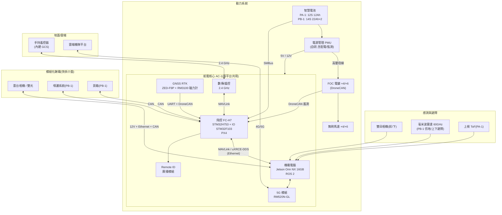
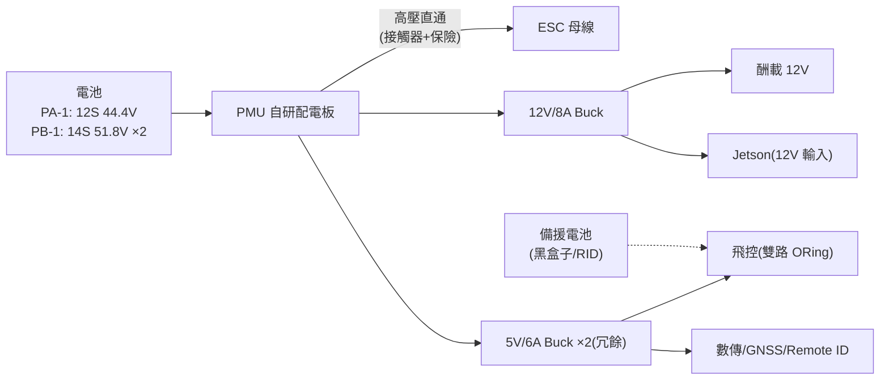

# 10-1 系統架構

> rev 2 · 2026-07。拓撲與匯流排結論不變;本版於 §2 加系統級功耗預算表(數字單一事實來源在各子系統文件)、§4 加酬載介面連接器列、新增 §5 介面契約索引。

## 1. 全系統方塊圖

兩個平台共用同一套航電拓撲(AC-1),差異只在動力規模與酬載。

### 架構要點

1. **飛控與機載電腦分離**:安全關鍵的飛行控制(PX4/FC-H7)與高算力應用(AI/避障/影像)隔離。Jetson 當機不影響飛安;飛控只接受經過驗證的 MAVLink 指令
2. **匯流排策略**:
   - 馬達電變、GNSS、酬載控制走 **DroneCAN**(抗噪、可熱插拔、有標準協議)
   - 飛控 ↔ 機載電腦走 **Ethernet(uXRCE-DDS + MAVLink)**,頻寬足夠傳感測器融合資料
   - 電池走 **SMBus**(智慧電池業界慣例)
3. **雙鏈路通訊**:2.4 GHz 數傳(低延遲、視距)+ 5G(BVLOS、影像上雲),飛控端自動路由
4. **酬載介面標準化**:機械快拆 + 12V 供電 + Ethernet + CAN,詳見 [30-structure/payload-interface.md](../30-structure/payload-interface.md)

## 2. 電源樹

- 飛控 5V 供電雙路 ORing:任一 Buck 故障不斷電
- PMU 量測母線電壓/電流,提供 PX4 電量估算;PB-1 版含預充電路(大電容 ESC 突波)與接觸器急停
- 酬載電源獨立限流,酬載短路不影響飛行系統

### 系統級功耗預算(rev A/EVT 實測後更新)

本表僅系統彙總;各數字的細目與單一事實來源在對應子系統文件(飛控細目在 [flight-controller.md §4](flight-controller.md)),與 [propulsion §4](propulsion.md)「航電 ~50 W」同口徑。

| 負載 | 預算 | 細目來源 |
|------|------|----------|
| Jetson Orin NX 16GB | ~25 W(峰值) | 20-software 機載應用側寫 |
| 飛控 FC-H7(含板上感測) | ~5 W(峰值口徑) | flight-controller §4.1 功耗預算表 |
| 數傳空中端 | ~8 W | communication.md |
| 5G RM520N-GL | ~6 W | communication.md |
| Remote ID | ~1 W | — |
| 避障感測(雙目/ToF/毫米波) | ~5 W | sensors-and-payload.md |
| **航電合計(不含酬載)** | **~50 W** | = propulsion §4 續航計算的航電項 |
| 相機/雲台(酬載 12V,獨立限流) | 10–15 W 預算 | [payload-interface.md](../30-structure/payload-interface.md) |

## 3. 資料流(任務執行時)

| 資料 | 路徑 | 頻率/頻寬 |
|------|------|-----------|
| 姿態控制迴路 | IMU → PX4 rate loop → ESC | 2 kHz 內迴路 |
| 位置控制 | GNSS/氣壓/光流 → EKF2 → 位置環 | 50 Hz |
| 避障 | 雙目/雷達 → Jetson(深度→佔據圖)→ 速度限制/繞行指令 → PX4 | 15–30 Hz |
| 遙測下行 | PX4 → 數傳 + Jetson → 5G → 雲端 | 1–4 Hz 摘要 + 事件 |
| 影像 | 雲台 → Jetson(編碼 H.265)→ 數傳/5G → GCS/雲端 | 1080p30, 2–8 Mbps |
| 日誌 | PX4 ULog → SD + 落地後自動上傳雲端 | 全程 |

## 4. 平台差異一覽

| 項目 | PA-1 | PB-1 |
|------|------|------|
| 動力 | 4 × MN505-S KV320 + 18" 槳 | 6 × P80 III KV100 + 30" 槳 |
| ESC | 40 A FOC DroneCAN | 80 A HV FOC DroneCAN |
| 電池 | 12S 12 Ah ×1 | 14S 22 Ah ×2(並聯、熱插拔) |
| GNSS 天線 | 單天線 RTK | 雙天線 RTK(定向,抗磁干擾) |
| 避障 | 前/下雙目 + 上 ToF | 前雙目 + 上/下毫米波 + 仿地雷達 |
| 酬載介面 | 下掛單點快拆 | 腹部大型快拆(藥箱/貨箱互換) |
| 酬載介面連接器 | QR-S | QR-L(選型與 pinout 見 [payload-interface.md](../30-structure/payload-interface.md),此處不重複) |
| 額外安全 | — | 降落傘艙(物流構型)、急停接觸器 |

## 5. 介面契約索引

跨端(機上/地面站/雲端)協議的單一事實來源在 [interfaces/](../../interfaces/README.md),契約先行、獨立版本化,本節僅索引:

| 契約 | 內容 | 位置 |
|------|------|------|
| MAVLink dialect | 酬載狀態、噴灑遙測、電池詳情(私有 message ID 24150–24199 級) | `interfaces/mavlink/` |
| Protobuf schema | 機-雲遙測與指令(MQTT/gRPC) | `interfaces/proto/` |
| 酬載描述檔 schema | QR-S/QR-L EEPROM 內容定義 | `interfaces/payload/` |
