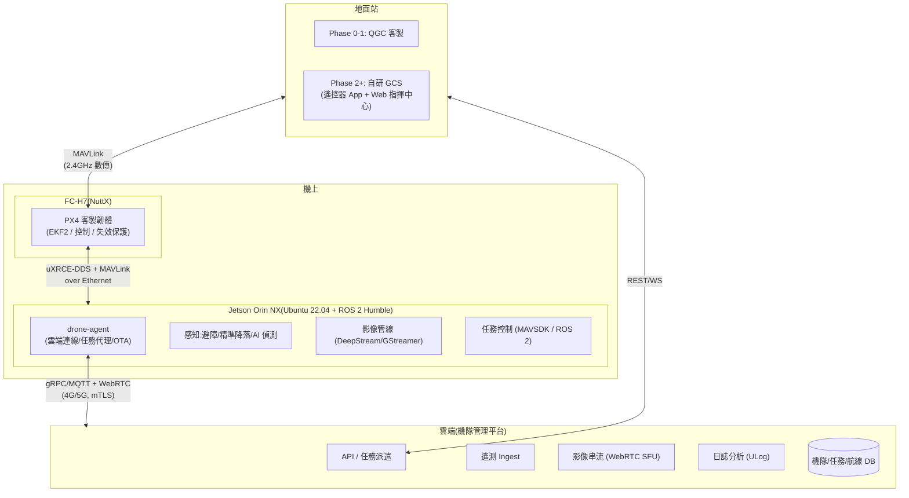

# 20-1 軟體整體架構

> rev 1 · 2026-07。版本紀錄見 §6。

## 1. 分層架構

## 2. 職責切分(安全邊界)

| 層 | 職責 | 絕不做 |
|----|------|--------|
| PX4(飛控) | 姿態/位置控制、EKF、失效保護、GeoFence、RC 直通 | 不依賴 Jetson 或網路才能安全飛行 |
| Jetson | 感知、AI、影像、任務編排、雲端連線、OTA | 不直接控馬達;只發 MAVLink 指令(受 PX4 驗證) |
| GCS | 操作介面、任務規劃、狀態監控 | 不做控制迴路 |
| 雲端 | 機隊調度、資料沉澱、遠端監控 | 斷線不影響飛行安全 |

**核心原則:每往外一層,即時性要求遞減、可用性依賴遞減。** 任何一層斷開,內層都有明確的降級行為(續飛/懸停/返航)。

## 3. 通訊協議選型

| 介面 | 協議 | 理由 |
|------|------|------|
| PX4 ↔ Jetson | uXRCE-DDS(ROS 2 topic)+ MAVLink(相容層) | PX4 v1.14+ 原生;高頻資料(視覺速度、避障 setpoint)走 DDS |
| PX4 ↔ 遙控器 GCS | MAVLink 2(簽章啟用) | 生態標準 |
| Jetson ↔ 雲 | MQTT(遙測,Protobuf 編碼)+ gRPC(指令)+ WebRTC(影像) | 行動網路友善、斷線重連語意清楚 |
| 酬載 | DroneCAN(控制)+ RTSP/Ethernet(影像) | 熱插拔、標準化 |

## 4. 版本與整合策略

- **Monorepo 分治**:`firmware/`(PX4 fork)、`onboard/`(ROS 2 workspace)、`gcs/`、`cloud/`、`hardware/`、`docs/`
- 介面契約先行:MAVLink 自訂訊息與 Protobuf schema 獨立版本化(`interfaces/` 目錄),機上/地面/雲端三方 codegen
- 每台機有硬體相容性矩陣:韌體版 × 機載版 × GCS 版 × 酬載韌體版,OTA 時強制檢查
- 模擬優先:SITL(Gazebo)跑通全任務流程才上實機;CI 內含 SITL 回歸(見 firmware.md)

## 5. 資安基線(商用必要)

- 機-雲 mTLS + WireGuard、MAVLink 2 signing、OTA 簽章(A/B 分區 + 回滾)
- 靜態加密(日誌/影像,客戶資料自主權賣點)、SBOM(歐盟 CRA 與美國市場前置)
- 威脅模型、PKI、合規對應與分階段落地,詳見 [security.md](security.md)

## 6. 版本紀錄

| rev | 日期 | 變更摘要 |
|-----|------|----------|
| 1 | 2026-07-10 | 初版(PR #1) |
| 1 | 2026-07-11 | 小幅修訂(不升版):§5 資安基線收斂為摘要,詳細移 [security.md](security.md) |
| 1 | 2026-07-12 | 形式化:補 rev 檔頭與版本紀錄(內容不變) |
