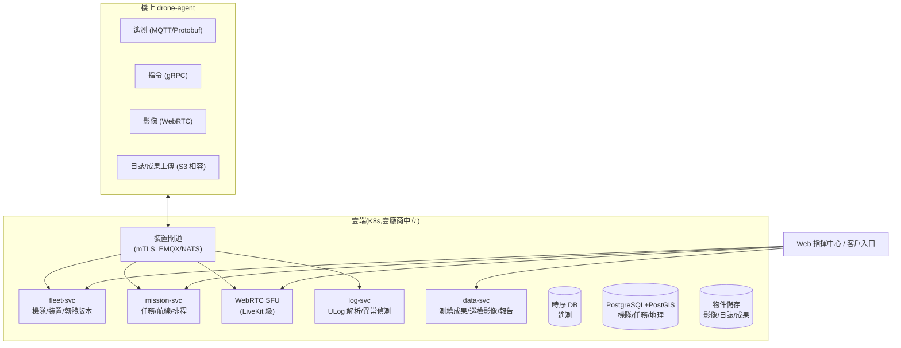

# 20-5 雲端機隊管理平台

> rev 1 · 2026-07。版本紀錄見 §6。

## 1. 定位

商用客戶買的不是一台飛機,是「營運能力」:多機狀態、任務派遣、資料沉澱、維保追蹤。雲端平台是軟體訂閱收入的載體,也是資料自主權賣點的落點(可交付**私有部署**版本給政府/電力客戶)。

## 2. 架構

## 3. 核心功能與階段

| 功能 | Phase | 說明 |
|------|-------|------|
| 裝置註冊/憑證/機隊儀表板 | 1(最小版) | 機隊清單、在線狀態、電量/位置 |
| 遙測即時圖 + 歷史查詢 | 1 | 1–4 Hz 摘要遙測入時序 DB |
| ULog 自動上傳與解析 | 1 | 落地自動上傳;異常規則(振動超標、電池衰減、EKF 告警)自動開維保單;規格(內容最小集/簽章/保存 ≥ 2 年)見 [firmware.md §6](firmware.md) |
| 禁航區圖資分發 | 1(靜態) | 三區圖資(台 CAA / FAA UAS Facility Maps / 歐盟 ED-269,adapter 見 [ground-station.md §5](ground-station.md))抓取/轉換/**簽章圖資包**分發,帶版本號 + 發布日期(REQ-NAV-06);動態空域(TFR/UTM)歸 Phase 3「UTM/航管對接」列 |
| 即時影像(WebRTC 多方觀看) | 2 | 指揮中心 + 分享連結(帶浮水印與權限) |
| 任務派遣與排程 | 2 | 航線庫、定時巡邏、任務結果回收 |
| 測繪成果管線 | 2 | 影像 + PPK → 對接第三方(ODM/Pix4D)或託管處理 |
| 農噴作業紀錄 | 2 | 地塊、藥量、軌跡回放(藥證合規紀錄需求) |
| OTA 管理 | 2 | 分批推送、版本相容矩陣、回滾 |
| 多租戶與私有部署 | 3 | Helm chart 交付,政府/電力客戶自建機房 |
| UTM/航管對接 | 3 | 台灣 UTM 試驗場域、美國 LAANC、歐 U-space 介接 |

## 4. 技術選型原則

- **雲廠商中立**(K8s + S3 相容儲存 + Postgres):私有部署是差異化賣點,不能綁死 AWS 專屬服務
- 遙測鏈路容忍行動網路特性:斷線緩存(機上 72h)、重連補傳、時鐘以 GNSS 對齊
- 後端:Go(裝置閘道/高並發)+ Python(資料/演算法);前端:React + MapLibre
- 影像:機上 H.265 → SFU 轉發,不轉碼(省成本);錄影留在機上 NVMe,按需回傳
- 資安:SOC2 型控制清單從第一天記帳;裝置憑證輪換;審計日誌

## 5. SLA 與成本意識

- 平台目標可用性 99.5%(飛行安全不依賴雲,SLA 壓力可控)
- 每機月流量預算:遙測 < 1 GB、影像按用量計費轉嫁;私有部署免流量問題

## 6. 任務派遣協議(契約草案)

「任務派遣與排程」(§3,Phase 2)的雲端側協議設計。機-雲線上契約仍以 [interfaces/](../../interfaces/README.md) proto 為單一事實來源,本節定義**雲端內部的派遣生命週期**與其對既有訊息的映射;正式 schema 於 interfaces v0.5 落地(見 interfaces/README「v0.5 規劃預告」)。

### 6.1 派遣生命週期

雲端派遣單(FleetMission)狀態機,與機上任務狀態(MissionProgress.State)分層——前者是「這件工作」,後者是「某台機這次執行」:

| 狀態 | 進入條件 | 說明 |
|------|----------|------|
| 建立(CREATED) | 使用者/排程器建單 | 航線、時窗、機型/酬載需求已定;尚未綁機 |
| 指派(ASSIGNED) | 調度器選機成功 | 綁定 drone_id;下發前跑相容性與自檢前置(禁航區圖資版本、電量、[ota.md §5](ota.md) 版本矩陣) |
| 執行(EXECUTING) | 機上回報 STATE_RECEIVED | 之後跟隨 MissionProgress 推進(UPLOADED/IN_PROGRESS/PAUSED) |
| 完成(COMPLETED) | 機上回報 STATE_COMPLETED 且成果回收確認 | ULog/成果上傳齊備才算閉環(對 REQ-OPS-03 端到端口徑) |
| 取消(CANCELLED) | 使用者取消或機上回報 STATE_FAILED | 執行中取消 = 下發 MissionCommand ABORT;失敗單可重新指派(回 CREATED,保留失敗紀錄) |

### 6.2 與既有 proto 的映射

| 生命週期動作 | 既有訊息(drone.v1) | 方向 |
|--------------|---------------------|------|
| 指派 → 下發 | `MissionPlan`(主題 `fleet/{drone_id}/cmd/mission`) | 雲 → 機 |
| 執行進度跟隨 | `MissionProgress`(主題 `fleet/{drone_id}/mission/progress`) | 機 → 雲 |
| 暫停/續飛/取消 | `MissionCommand` PAUSE/RESUME/ABORT(主題 `fleet/{drone_id}/cmd/mission_ctrl`) | 雲 → 機 |

派遣單自身(FleetMission)不上線——機上只認 MissionPlan;`mission_id` 由派遣單產生並貫穿全鏈(派遣單 ↔ MissionPlan ↔ MissionProgress ↔ ULog 歸檔),是端到端追溯鍵。

### 6.3 多機併發規則

- **一機一活動任務**:同一 drone_id 同時至多一張 EXECUTING 派遣單——與機上 drone-agent 的互斥一致(執行中收到新 mission_id 即拒收回 FAILED),雲端調度器是第一道閘,機上互斥是保底
- 一張派遣單一次只綁一台機;多機協同(同一區域拆分航線)= 多張派遣單掛同一父工單,Phase 3 再議
- 調度器選機準則(電量/位置/酬載/版本相容)屬 mission-svc 實作細節,本契約只約束狀態機與互斥

### 6.4 冪等與去重

MQTT QoS 1 為 **at-least-once**(S12 既定語意,見 [interfaces/README](../../interfaces/README.md) 與 onboard/drone_agent):

- **下行去重**:同一 `mission_id` 的 MissionPlan 重複投遞,機上以 mission_id 去重(執行中/已終態皆忽略重複),雲端重送安全——下發重試以此為前提
- **上行去重**:MissionProgress 終態(COMPLETED/FAILED)可能重複,派遣單狀態轉移必須冪等:終態只接受一次,重複到達忽略;亂序防護以事件內 `unix_time_ms` 判舊
- **取消競態**:CANCELLED 與機上 COMPLETED 同時發生時,以機上終態為準(任務實際飛完就是完成),取消記為未生效

## 7. 版本紀錄

| rev | 日期 | 變更摘要 |
|-----|------|----------|
| 1 | 2026-07-10 | 初版(PR #1) |
| 1 | 2026-07-11 | 小幅修訂(不升版):§3 補禁航區圖資分發列(REQ-NAV-06)與 ULog 規格引註([firmware §6](firmware.md)) |
| 1 | 2026-07-12 | 形式化:補 rev 檔頭與版本紀錄(內容不變) |
| 1 | 2026-07-12 | 新增 §6 任務派遣協議(契約草案):生命週期/proto 映射/冪等去重(D13) |
