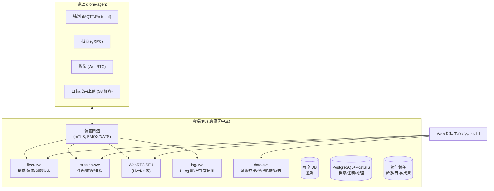

# 20-5 雲端機隊管理平台

## 1. 定位

商用客戶買的不是一台飛機,是「營運能力」:多機狀態、任務派遣、資料沉澱、維保追蹤。雲端平台是軟體訂閱收入的載體,也是資料自主權賣點的落點(可交付**私有部署**版本給政府/電力客戶)。

## 2. 架構

## 3. 核心功能與階段

| 功能 | Phase | 說明 |
|------|-------|------|
| 裝置註冊/憑證/機隊儀表板 | 1(最小版) | 機隊清單、在線狀態、電量/位置 |
| 遙測即時圖 + 歷史查詢 | 1 | 1–4 Hz 摘要遙測入時序 DB |
| ULog 自動上傳與解析 | 1 | 落地自動上傳;異常規則(振動超標、電池衰減、EKF 告警)自動開維保單 |
| 即時影像(WebRTC 多方觀看) | 2 | 指揮中心 + 分享連結(帶浮水印與權限) |
| 任務派遣與排程 | 2 | 航線庫、定時巡邏、任務結果回收 |
| 測繪成果管線 | 2 | 影像 + PPK → 對接第三方(ODM/Pix4D)或託管處理 |
| 農噴作業紀錄 | 2 | 地塊、藥量、軌跡回放(藥證合規紀錄需求) |
| OTA 管理 | 2 | 分批推送、版本相容矩陣、回滾 |
| 多租戶與私有部署 | 3 | Helm chart 交付,政府/電力客戶自建機房 |
| UTM/航管對接 | 3 | 台灣 UTM 試驗場域、美國 LAANC、歐 U-space 介接 |

## 4. 技術選型原則

- **雲廠商中立**(K8s + S3 相容儲存 + Postgres):私有部署是差異化賣點,不能綁死 AWS 專屬服務
- 遙測鏈路容忍行動網路特性:斷線緩存(機上 72h)、重連補傳、時鐘以 GNSS 對齊
- 後端:Go(裝置閘道/高並發)+ Python(資料/演算法);前端:React + MapLibre
- 影像:機上 H.265 → SFU 轉發,不轉碼(省成本);錄影留在機上 NVMe,按需回傳
- 資安:SOC2 型控制清單從第一天記帳;裝置憑證輪換;審計日誌

## 5. SLA 與成本意識

- 平台目標可用性 99.5%(飛行安全不依賴雲,SLA 壓力可控)
- 每機月流量預算:遙測 < 1 GB、影像按用量計費轉嫁;私有部署免流量問題
