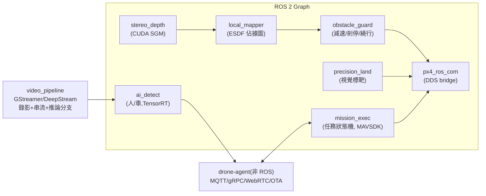

# 20-3 機載電腦(Jetson / ROS 2)

> rev 1 · 2026-07。版本紀錄見 §5。

## 1. 平台

| 項目 | 規格 |
|------|------|
| 硬體 | NVIDIA Jetson Orin NX 16GB(100 TOPS)+ 自研載板;低配機型可降 Orin Nano 8GB |
| OS | Ubuntu 22.04(JetPack 6)+ 唯讀根檔案系統 + A/B 分區 OTA |
| 中介層 | ROS 2 Humble;與 PX4 經 uXRCE-DDS(Ethernet) |
| 儲存 | NVMe 512GB(影像/日誌),循環覆寫策略 |

選 Jetson 而非 RPi/工控 x86:避障深度計算 + AI 推論需要 GPU/加速器;Orin NX 功耗 10–25 W 可接受;CUDA 生態成熟。風險:單一供應商 → 載板設計相容 Orin NX/Nano 兩級,依 BOM 目標切換。

## 2. 機上軟體模組

| 模組 | Phase | 說明 |
|------|-------|------|
| obstacle_guard | 1 | 前向剎停 + 上下限高;繞行於 Phase 2 |
| precision_land | 1 | ArUco/AprilTag 標靶降落 < 30 cm(物流/機巢前置) |
| mission_exec | 1 | 雲端任務 → MAVLink 任務轉譯、進度回報、續飛邏輯 |
| video_pipeline | 1 | H.265 編碼、本地錄影、RTSP/WebRTC 出流 |
| ai_detect | 2 | 人/車偵測(巡邏告警);模型:RT-DETR/YOLO 系,TensorRT INT8 |
| drone-agent | 1 | 裝置註冊、遙測上雲、指令下行、OTA、健康監控(systemd watchdog) |

## 3. 開發規範

- 每個 ROS 2 node 有 lifecycle 管理與 watchdog;任一感知 node 崩潰 → obstacle_guard 進入保守模式(限速)並回報,不影響 PX4 飛行
- 所有感知輸出帶時間戳與置信度;向 PX4 只發**速度限制與 setpoint 修正**,絕不發姿態級指令
- 記錄:rosbag2(感知)+ ULog(飛控)以 PPS/PTP 時間對齊,事故可回放
- 模擬:Gazebo + 感測器模型(雙目/雷達)跑感知回歸;CI 於 x86+GPU runner 上執行

## 4. OTA 與遠端維運

- A/B 分區、簽章映像、失敗自動回滾;OTA 僅地面且電量 > 40% 時執行
- 遠端診斷通道(反向 SSH over WireGuard,需雲端雙人授權)——商用機隊維運的剛需

## 5. 版本紀錄

| rev | 日期 | 變更摘要 |
|-----|------|----------|
| 1 | 2026-07-10 | 初版(PR #1) |
| 1 | 2026-07-12 | 形式化:補 rev 檔頭與版本紀錄(內容不變) |
