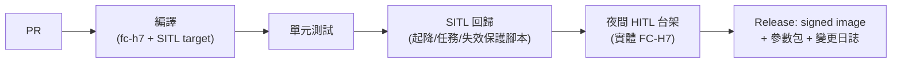

# 20-2 飛控韌體(PX4 客製)

> rev 2 · 2026-07。rev 1 策略(fork 最小化、不改飛安核心)與客製清單結論不變;本版於 §2 補 GeoFence 禁航區客製列、新增 §6 飛行日誌(ULog)規格(REQ-SAF-02 細化)。版本紀錄見 §7。

## 1. 策略

Fork **PX4 v1.15(或當時最新 stable)**,客製範圍刻意最小化:

- **改**:板級支援(FC-H7)、機型配置、失效保護參數、少量自訂模組
- **不改**:EKF2、核心控制器、狀態機——升級 upstream 時 merge 成本最低,且飛安核心保持社群驗證狀態
- 每 6–12 個月 rebase 一次 upstream stable;自訂 patch 控制在 20 個 commit 以內

## 2. 客製項目清單

| 項目 | 內容 | 工作量 |
|------|------|--------|
| Board bring-up | `boards/<vendor>/fc-h7`:pin map、感測器驅動掛載、dts、bootloader | 1–2 人月(rev A) |
| 機型配置 | PA-1 四軸與 PB-1 六軸 airframe:control allocation、混控、預設參數包 | 0.5 人月/機型 + 調參 |
| 智慧電池 | SMBus 驅動對接自研 BMS(容量/健康度/加熱控制) | 0.5 人月 |
| 噴灑控制模組 | 自訂模組:流量閉環、與速度聯動的畝用量控制、斷點記錄(PB-1) | 1.5 人月 |
| 貨物管理 | 貨箱鎖固狀態機、重量異常偵測(PB-1) | 0.5 人月 |
| 失效保護策略 | 依場景客製:農噴斷藥返航、物流鏈路分級降級、降落傘觸發介面 | 1 人月 |
| 自訂 MAVLink | 酬載狀態、噴灑遙測、電池詳情等 dialect | 0.5 人月 |
| GeoFence 禁航區 | 多邊形 + 圓形複合圍欄(PX4 內建圍欄引擎,不改核心):禁航區圖資→機上圍欄格式轉換與容量規劃(≥ 32 多邊形 / 128 頂點級,設計值 rev A 實測定容;**SITL posix dataman 代理量測**(`firmware/tools/smoke/assert_geofence.py`):單一多邊形上傳-回讀往返在 ≤ 64 頂點通過、128 頂點被拒,多邊形維度 8×8=64 total 通過——posix dataman 容量 ≠ FC-H7 flash,實機容量 rev A 定容)、機上檢核 ≥ 1 Hz、觸發行為沿用「不穿越圍欄 > 10 m」既有口徑(REQ-NAV-04 / REQ-NAV-06);圖資來源與 GCS/雲端分工見 [ground-station.md §5](ground-station.md) | 0.5 人月 |

## 3. 調參與飛測流程(每機型)

> 飛測架次與通過準則統一由 [02-verification-validation.md](../02-verification-validation.md) 的 RTM 管理(Phase 0 載體為 F01–F20);本節維護韌體側流程。

1. **SITL**:Gazebo 模型(慣量/推力由實測填入)先驗證任務邏輯
2. **HITL/台架**:FC-H7 接實體 ESC 於推力台,驗證輸出鏈路
3. **繫留懸停**:安全繩下首飛,rate loop → attitude → position 逐環整定(PID + 濾波器以 log FFT 定 notch)
4. **開闊場包線**:速度/風/滿載/重心極限,每包線點留 ULog
5. **耐久**:累計 50 h(PA-1)無重大故障進入下一階段

## 4. CI/CD

- 失效保護場景全部腳本化:失聯、低電、GPS 拒止、單馬達失效(PB-1)、GeoFence 穿越——每次改動必跑
- 釋出的韌體映像簽章,GCS/OTA 只接受簽章版本;參數包與韌體版本綁定

## 5. 授權合規

PX4 為 BSD-3 授權:允許閉源商用、無 copyleft 義務(對比 ArduPilot 的 GPLv3——這是選 PX4 的商業理由之一)。保留版權聲明即可;自研模組可閉源。

## 6. 飛行日誌(ULog)規格

> REQ-SAF-02 的軟體面規格,定義「記什麼、多快、存多大、留多久」。分工邊界:硬體掉電保持(斷電偵測 → flush ≤ 20 ms、保持電容)見 [flight-controller.md §4.2](../10-hardware/flight-controller.md);落地上傳、雲端解析與異常開單見 [cloud-fleet.md §3](cloud-fleet.md)。

### 6.1 記錄內容最小集(事故調查欄位)

| 類別 | 內容 |
|------|------|
| 姿態/位置 | EKF2 姿態與位置估算輸出 + raw IMU(三顆全記) |
| GNSS | raw 觀測量 + RTK 狀態(Fixed/Float/單點)與基準站鏈路狀態 |
| 操控鏈 | RC 輸入、執行器輸出、ESC 遙測(轉速/溫度/電流) |
| 電池 | SMBus 全欄位(總壓/電流/單芯電壓/溫度/SoC/SoH/告警旗標) |
| 事件 | 失效保護事件與飛行模式切換、GeoFence 事件(觸發/動作)、酬載電源事件、防撞燈開關狀態 |

本表是 VT-SAF-02「事故調查欄位齊備性檢核」的逐欄比對基準;新增酬載或自訂模組(§2)時必須同步擴充本表。

### 6.2 記錄速率

- 基線 = PX4 logger 預設 profile(估算輸出 ~100 Hz 級、事件與狀態即時記錄)
- 高速段:raw IMU 高速記錄 profile(gyro FFT / notch 濾波器整定用,對 §3 流程 3):調參期全程開啟、量產期抽測架次開啟

### 6.3 容量估算與 microSD 選型

- 高速 profile 下寫入量 ~1 GB/h 級(設計值,rev A 以實測 log 校正)
- 單日最壞情況:20 架次 × ~45 min ≈ 15 h → **~15 GB/日**
- 選型:工業級 microSD ≥ 64 GB 即可單日不落盤滿(~4 日裕度);設計基線取 **128 GB**(留 wear-leveling 與寫入劣化裕度),料號對 [flight-controller.md §3](../10-hardware/flight-controller.md) microSD 列(SanDisk Industrial / ATP)

### 6.4 QSPI 黑盒子(128 MB 備援)

- microSD 失效/脫落時的第二儲存([flight-controller.md §2](../10-hardware/flight-controller.md) W25N01GV):僅記「關鍵子集」= §6.1 事件類全項 + 估算輸出降頻 + 電池摘要,**不含 raw IMU**
- 子集速率預算 ~100 KB/s → 128 MB ≈ 最後 ~20 分鐘環形緩衝;設計要求 = **保留最後 ≥ 15 分鐘**(設計值,rev A 實測定案)
- 對應 EU 2019/945 C5/C6 級標章的 flight recorder 要求(2026-07 查核,送件前以最新版覆核)

### 6.5 檔案中繼資料與防竄改

- 每檔記入:**韌體版本**(git hash + release tag)、**參數 hash**(全參數集 SHA-256)、**機身序號**——以 ULog header 原生資訊欄位承載,與 §4 「參數包與韌體版本綁定」互證
- 防竄改簽章:落地關檔後機上以裝置私鑰對日誌 hash 簽章,雲端驗章後歸檔;缺章/驗章失敗的日誌標記為不可信 [S]

### 6.6 上傳與保存

- 落地自動上傳:drone-agent 經 S3 相容通道上傳,log-svc 解析與異常自動開單(見 [cloud-fleet.md §3](cloud-fleet.md));斷網時機上緩存補傳(cloud-fleet §4 既有 72 h 口徑)
- 雲端保存 **≥ 2 年**(REQ-SAF-02):對齊事故調查與保險舉證需求——歐盟 EU 376/2014 事故通報、美國 FAA 14 CFR §107.9 事故通報(2026-07 查核,送件前以最新版覆核);**各區最短保存年限要求需查證後定案**,≥ 2 年為設計下限

## 7. 參數基線管理

§4「參數包與韌體版本綁定」的管理制度。參數包是飛行行為的一半,與韌體同等對待:

### 7.1 命名與綁定

- **命名:`<機型>-<硬體 rev>-v<版本>.params`**(如 `pa1-revA-v3.params`);Phase 0 開發機現行落地物為 [tools/flight_ops/params/](../../tools/flight_ops/params/) 的 `dev-machine-v1.params`(開發機不分 rev,機型名 `dev-machine`),兩機參數分開版控時各自成檔
- **與韌體版綁定**:每個韌體 release 標注「驗證所用參數包版本」,參數包檔頭記錄對應韌體版;release pipeline(§4)將兩者同批釋出——只升韌體不升參數包(或反之)須經 §7.2 變更流程重新驗證
- 參數包內容基線 = [build-and-first-flight.md §3](../50-project/phase0/build-and-first-flight.md) 初始設定清單(失效保護參數表 + 電池參數);寫入/核對工具為 `tools/flight_ops/apply_params.py`(`--dry-run` 為飛行日核對)

### 7.2 變更流程

1. **提案**:PR 修改參數檔,附動機與影響參數清單(失效保護類參數變更需標注對 [03-safety-analysis.md](../03-safety-analysis.md) 失效保護矩陣的影響)
2. **SITL 驗證**:失效保護場景腳本全跑(§4 CI 清單);涉及調參類(PID/濾波)另跑對應 SITL/台架項
3. **凍結**:合併即凍結為新版本號;`apply_params.py` 寫入 + 逐項回讀比對通過才算部署完成
4. **追溯**:每筆 ULog 檔頭帶全參數集 SHA-256(§6.5 參數 hash)——事後任何一筆飛行可反查當時參數基線;hash 對不上已凍結版本 = 機上參數曾被手動改動,按未授權變更處理(飛行日 `--dry-run` 核對即為此把關)

## 8. 版本紀錄

| rev | 日期 | 變更摘要 |
|-----|------|----------|
| 1 | 2026-07-10 | 初版(PR #1) |
| 2 | 2026-07-11 | §2 補 GeoFence 禁航區客製列(REQ-NAV-04/06);新增 §6 飛行日誌(ULog)規格——記錄最小集/速率/容量/QSPI 黑盒/防竄改/保存(REQ-SAF-02 細化);§3 補 V&V RTM 引註 |
| 2 | 2026-07-12 | 形式化:補 rev 檔頭與版本紀錄(內容不變) |
| 2 | 2026-07-12 | 新增 §7 參數基線管理:命名綁定/變更流程/ULog param hash 追溯(D13) |
