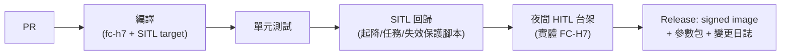

# 20-2 飛控韌體(PX4 客製)

## 1. 策略

Fork **PX4 v1.15(或當時最新 stable)**,客製範圍刻意最小化:

- **改**:板級支援(FC-H7)、機型配置、失效保護參數、少量自訂模組
- **不改**:EKF2、核心控制器、狀態機——升級 upstream 時 merge 成本最低,且飛安核心保持社群驗證狀態
- 每 6–12 個月 rebase 一次 upstream stable;自訂 patch 控制在 20 個 commit 以內

## 2. 客製項目清單

| 項目 | 內容 | 工作量 |
|------|------|--------|
| Board bring-up | `boards/<vendor>/fc-h7`:pin map、感測器驅動掛載、dts、bootloader | 1–2 人月(rev A) |
| 機型配置 | PA-1 四軸與 PB-1 六軸 airframe:control allocation、混控、預設參數包 | 0.5 人月/機型 + 調參 |
| 智慧電池 | SMBus 驅動對接自研 BMS(容量/健康度/加熱控制) | 0.5 人月 |
| 噴灑控制模組 | 自訂模組:流量閉環、與速度聯動的畝用量控制、斷點記錄(PB-1) | 1.5 人月 |
| 貨物管理 | 貨箱鎖固狀態機、重量異常偵測(PB-1) | 0.5 人月 |
| 失效保護策略 | 依場景客製:農噴斷藥返航、物流鏈路分級降級、降落傘觸發介面 | 1 人月 |
| 自訂 MAVLink | 酬載狀態、噴灑遙測、電池詳情等 dialect | 0.5 人月 |

## 3. 調參與飛測流程(每機型)

> 飛測架次與通過準則統一由 [02-verification-validation.md](../02-verification-validation.md) 的 RTM 管理(Phase 0 載體為 F01–F20);本節維護韌體側流程。

1. **SITL**:Gazebo 模型(慣量/推力由實測填入)先驗證任務邏輯
2. **HITL/台架**:FC-H7 接實體 ESC 於推力台,驗證輸出鏈路
3. **繫留懸停**:安全繩下首飛,rate loop → attitude → position 逐環整定(PID + 濾波器以 log FFT 定 notch)
4. **開闊場包線**:速度/風/滿載/重心極限,每包線點留 ULog
5. **耐久**:累計 50 h(PA-1)無重大故障進入下一階段

## 4. CI/CD

- 失效保護場景全部腳本化:失聯、低電、GPS 拒止、單馬達失效(PB-1)、GeoFence 穿越——每次改動必跑
- 釋出的韌體映像簽章,GCS/OTA 只接受簽章版本;參數包與韌體版本綁定

## 5. 授權合規

PX4 為 BSD-3 授權:允許閉源商用、無 copyleft 義務(對比 ArduPilot 的 GPLv3——這是選 PX4 的商業理由之一)。保留版權聲明即可;自研模組可閉源。
