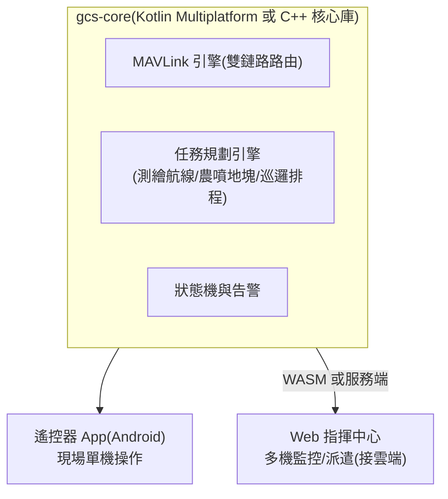

# 20-4 地面站(GCS)

> rev 2 · 2026-07。rev 1 兩階段策略(QGC 客製 → 自研)不變;本版新增 §5 禁航區圖層(REQ-NAV-06 GCS 側規格),§1 補 QGC 客製深度評估結論引註。版本紀錄見 §6。

## 1. 兩階段策略

| 階段 | 方案 | 理由 |
|------|------|------|
| Phase 0–1 | **QGroundControl 客製 fork**(branding、鎖定機型、簡化 UI) | 立即可用、支援完整 MAVLink 生態;讓團隊聚焦飛機本體 |
| Phase 2+ | **自研 GCS**:遙控器 Android App + Web 指揮中心(共用核心) | QGC 對「行業工作流」(測繪分區、農噴地塊、巡邏排程)客製成本高;自研才能做出產品差異 |

> QGC 為 Apache 2.0 / GPLv3 雙授權——商用 fork 需注意:以 Apache 2.0 部分為基礎或保持 GPL 合規(App 開源不影響硬體/雲端閉源)。自研 GCS 則無此限制。
> 客製深度(stock 預設檔 / 官方 custom-build 模板 / 深 fork)的完整評估、授權合規路徑與 Phase 1 逐項判級,見 [gcs-qgc-evaluation.md](gcs-qgc-evaluation.md)——結論:Phase 1 用 custom-build 模板即可,不做深 fork。

## 2. 自研 GCS 架構(Phase 2)

## 3. 功能需求(依場景)

| 功能 | 場景 | Phase |
|------|------|-------|
| 飛行儀表、地圖、影像、告警 | 全部 | 1(QGC 已有) |
| 測繪航線規劃(多邊形分區、重疊率、GSD 計算、斷點續飛) | 測繪 | 1(QGC survey)→ 2 強化 |
| 農噴地塊管理(田塊匯入、障礙標記、處方圖、藥量計算) | 農業 | 2 |
| 巡邏排程(定時任務、航線庫、告警聯動) | 安防 | 2(與雲端聯動) |
| 物流航線走廊、起降點管理 | 物流 | 3 |
| 多機同屏監控 | 安防/物流 | 2(Web) |
| 離線地圖、台灣圖資(TGOS/國土測繪中心 WMTS) | 全部 | 1 |
| 飛行紀錄回放、電子圍欄與禁航區(依區域法規圖層,見 §5) | 全部 | 1–2 |

## 4. UX 原則

- 「一鍵任務」:選航線 → 自檢清單自動跑(感測器/電量/RTK/鏈路)→ 起飛;自檢不過不給飛
- 告警分三級(提示/警告/緊急),緊急告警全螢幕 + 震動 + 語音,並附「建議動作」按鈕(立即返航/懸停)
- 所有不可逆操作(強制降落、關閉避障)二次確認
- 中英雙語起步(台灣市場中文優先,認證市場英文)

## 5. 禁航區圖層(法規圖資)

REQ-NAV-06 的 GCS 側規格。三層分工、各層獨立保底:

| 層 | 職責 | 該層以外全失效時的保底 |
|----|------|------------------------|
| 機上(PX4 GeoFence) | 飛行中行為:檢核 ≥ 1 Hz、不穿越圍欄 > 10 m(見 [firmware.md §2](firmware.md) GeoFence 列) | GCS/雲端失效仍不穿越已載入圍欄 |
| GCS(本節) | 任務規劃期檢核 + 起飛前告警 | 雲端失聯用本地快取圖資規劃(帶逾期告警) |
| 雲端 | 圖資管線:抓取/轉換/簽章/分發(見 [cloud-fleet.md §3](cloud-fleet.md)) | 雲端停擺不影響已分發圖資的規劃與飛行 |

### 5.1 三區圖資 adapter

| 區 | 來源 | 格式/備註 |
|----|------|----------|
| 台灣 | CAA 禁航區/限航區圖資(民航局公告) | 機讀格式現況**需查證**(歷史上以公告 + 圖檔為主,可能需自建轉換管線) |
| 美國 | FAA UAS Facility Maps(輔以 NOTAM/TFR) | 機讀格式公開;TFR 屬動態空域,歸 Phase 3 UTM/LAANC 介接 |
| 歐盟 | ED-269(EASA 地理感知通用資料格式)(2026-07 查核,送件前以最新版覆核) | C 級標章 geo-awareness 功能的資料格式基準 |

三個 adapter 輸出統一內部格式(多邊形 + 圓形 + 高度上限 + 生效時段),供任務規劃引擎與機上圍欄格式轉換(firmware §2)共用。

### 5.2 版本化、逾期告警與規劃期拒絕

- 每份圖資包帶**版本號 + 發布日期**,由雲端簽章分發(cloud-fleet §3);GCS 只接受驗章通過的圖資包
- 圖資發布日期距今 **> 30 天**:起飛前檢查表告警(警告級,不禁飛——保留離線作業能力,但操作人須確認當日 NOTAM/公告)
- 任務規劃期:航點或航線穿越**禁航區即拒絕**(不可覆寫);限航區給警告,持專案核准者可確認後續行

## 6. 版本紀錄

| rev | 日期 | 變更摘要 |
|-----|------|----------|
| 1 | 2026-07-10 | 初版(PR #1) |
| 2 | 2026-07-11 | 新增 §5 禁航區圖層——三層分工/三區圖資 adapter/版本化與規劃期拒絕(REQ-NAV-06);§1 補 [gcs-qgc-evaluation.md](gcs-qgc-evaluation.md) 結論引註(Phase 1 用 custom-build 模板,不深 fork) |
| 2 | 2026-07-12 | 形式化:補 rev 檔頭與版本紀錄(內容不變) |
