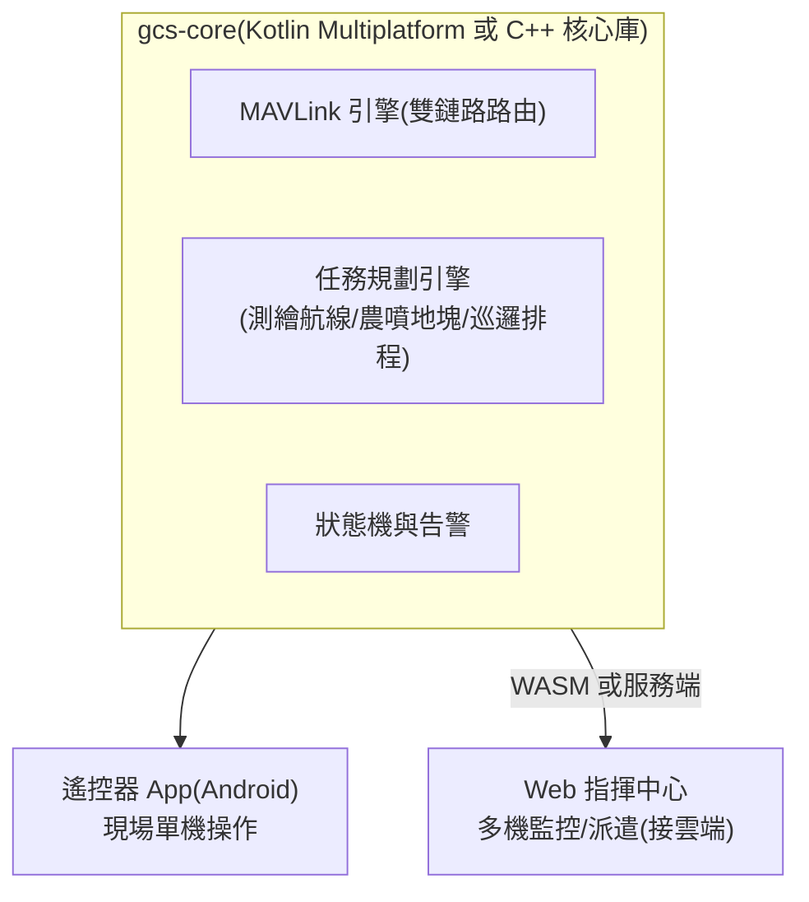

# 20-4 地面站(GCS)

## 1. 兩階段策略

| 階段 | 方案 | 理由 |
|------|------|------|
| Phase 0–1 | **QGroundControl 客製 fork**(branding、鎖定機型、簡化 UI) | 立即可用、支援完整 MAVLink 生態;讓團隊聚焦飛機本體 |
| Phase 2+ | **自研 GCS**:遙控器 Android App + Web 指揮中心(共用核心) | QGC 對「行業工作流」(測繪分區、農噴地塊、巡邏排程)客製成本高;自研才能做出產品差異 |

> QGC 為 Apache 2.0 / GPLv3 雙授權——商用 fork 需注意:以 Apache 2.0 部分為基礎或保持 GPL 合規(App 開源不影響硬體/雲端閉源)。自研 GCS 則無此限制。

## 2. 自研 GCS 架構(Phase 2)

## 3. 功能需求(依場景)

| 功能 | 場景 | Phase |
|------|------|-------|
| 飛行儀表、地圖、影像、告警 | 全部 | 1(QGC 已有) |
| 測繪航線規劃(多邊形分區、重疊率、GSD 計算、斷點續飛) | 測繪 | 1(QGC survey)→ 2 強化 |
| 農噴地塊管理(田塊匯入、障礙標記、處方圖、藥量計算) | 農業 | 2 |
| 巡邏排程(定時任務、航線庫、告警聯動) | 安防 | 2(與雲端聯動) |
| 物流航線走廊、起降點管理 | 物流 | 3 |
| 多機同屏監控 | 安防/物流 | 2(Web) |
| 離線地圖、台灣圖資(TGOS/國土測繪中心 WMTS) | 全部 | 1 |
| 飛行紀錄回放、電子圍欄與禁航區(依區域法規圖層) | 全部 | 1–2 |

## 4. UX 原則

- 「一鍵任務」:選航線 → 自檢清單自動跑(感測器/電量/RTK/鏈路)→ 起飛;自檢不過不給飛
- 告警分三級(提示/警告/緊急),緊急告警全螢幕 + 震動 + 語音,並附「建議動作」按鈕(立即返航/懸停)
- 所有不可逆操作(強制降落、關閉避障)二次確認
- 中英雙語起步(台灣市場中文優先,認證市場英文)
