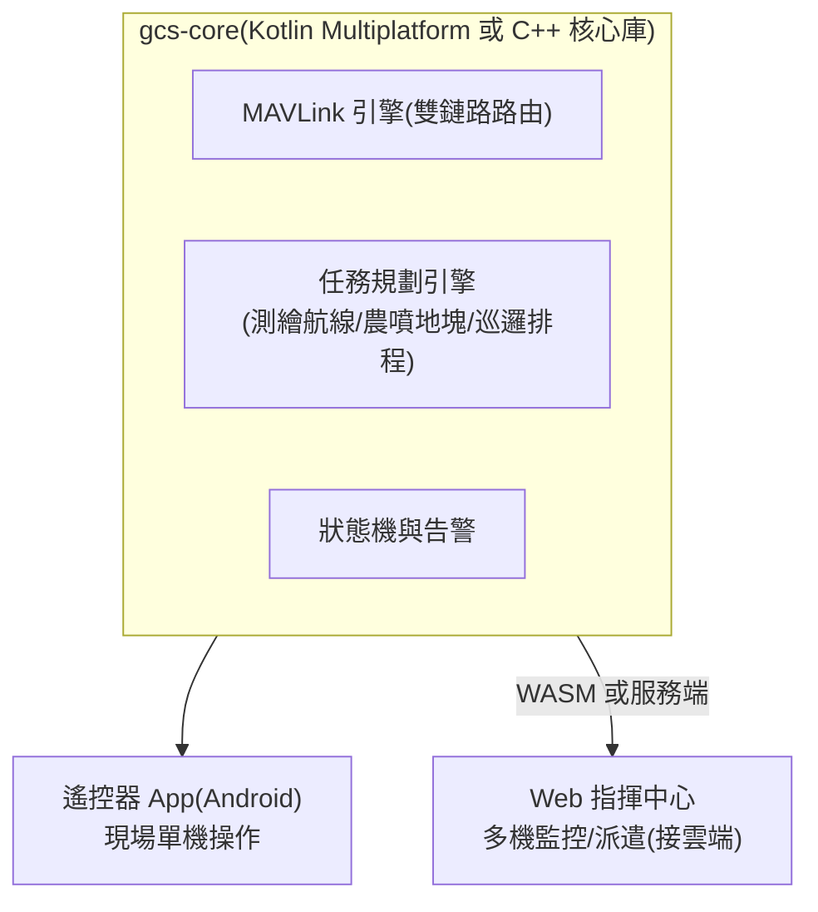

# 20-4 地面站(GCS)

## 1. 兩階段策略

| 階段 | 方案 | 理由 |
|------|------|------|
| Phase 0–1 | **QGroundControl 客製 fork**(branding、鎖定機型、簡化 UI) | 立即可用、支援完整 MAVLink 生態;讓團隊聚焦飛機本體 |
| Phase 2+ | **自研 GCS**:遙控器 Android App + Web 指揮中心(共用核心) | QGC 對「行業工作流」(測繪分區、農噴地塊、巡邏排程)客製成本高;自研才能做出產品差異 |

> QGC 為 Apache 2.0 / GPLv3 雙授權——商用 fork 需注意:以 Apache 2.0 部分為基礎或保持 GPL 合規(App 開源不影響硬體/雲端閉源)。自研 GCS 則無此限制。
> 客製深度(stock 預設檔 / 官方 custom-build 模板 / 深 fork)的完整評估、授權合規路徑與 Phase 1 逐項判級,見 [gcs-qgc-evaluation.md](gcs-qgc-evaluation.md)——結論:Phase 1 用 custom-build 模板即可,不做深 fork。

## 2. 自研 GCS 架構(Phase 2)

### 2.1 共用核心(gcs-core)

兩個前端共用一套核心庫,避免「App 與 Web 行為不一致」這類商用 GCS 常見病:

- **狀態模型**:單一機況真相(姿態/位置/電量/模式/告警/任務進度)——前端只讀狀態模型渲染,不各自解析協議;多機時每機一個狀態實例
- **協議層**:MAVLink 引擎(數傳直連 + 蜂窩經雲端中繼的雙鏈路路由與去重)、與雲端 REST/WS 的 client;訊息定義取自 [interfaces/](../../interfaces/README.md)(proto + 自訂 dialect)codegen,不手寫
- **任務規劃引擎**:測繪航線/農噴地塊/巡邏排程的幾何計算與禁航區檢核(§5)——放核心層,App 離線可用、Web 端同一套結果

### 2.2 兩前端分工

| | 遙控器 App(Android) | Web 指揮中心 |
|--|---------------------|--------------|
| 角色 | 現場操作者:單機(至多雙機)飛行操作 | 指揮/管理者:多機監控、派遣、回放 |
| 鏈路 | 數傳直連為主,蜂窩為輔——**斷網可完整作業** | 一律經雲端 API,不直連飛機 |
| 控制權 | 持有 RC 控制權與緊急接管 | 只下任務級指令(派遣/暫停/返航請求),無姿態級控制(對 [architecture.md §2](architecture.md) 安全邊界) |
| 任務規劃 | 現場規劃 + 離線圖資快取 | 航線庫管理、排程、批次派遣 |

### 2.3 與雲端 API 的邊界

- Web 指揮中心是雲端平台([cloud-fleet.md](cloud-fleet.md))的前端,派遣走 cloud-fleet §6 契約;App 產生的航線/紀錄經雲端同步入航線庫——**兩前端不直接互通**,雲端是唯一同步點
- 控制權仲裁:同一機同時只有一個控制來源(App 現場 > 雲端派遣);仲裁狀態入 gcs-core 狀態模型並全端可見

### 2.4 技術選型候選(Phase 2 啟動時定案,不預作結論)

| 層 | 候選 | 取捨要點 |
|----|------|----------|
| gcs-core | Kotlin Multiplatform / C++(+ 綁定) / Rust(+ FFI/WASM) | KMP 對 Android 最順、WASM 支援次之;C++/Rust 覆用性佳但 App 端膠水成本高 |
| App | 原生 Android(Compose) | 遙控器硬體為 Android 平台(bom §4 路線 1),無跨平台需求 |
| Web | React + MapLibre(沿用雲端前端選型,cloud-fleet §4) | 與指揮中心/客戶入口同棧 |
| 核心→Web 橋 | WASM 編譯 vs 服務端(核心跑雲端、Web 純視圖) | WASM 免伺服器往返;服務端簡化多人一致性——依指揮中心協同編輯需求定 |

## 3. 功能需求(依場景)

| 功能 | 場景 | Phase |
|------|------|-------|
| 飛行儀表、地圖、影像、告警 | 全部 | 1(QGC 已有) |
| 測繪航線規劃(多邊形分區、重疊率、GSD 計算、斷點續飛) | 測繪 | 1(QGC survey)→ 2 強化 |
| 農噴地塊管理(田塊匯入、障礙標記、處方圖、藥量計算) | 農業 | 2 |
| 巡邏排程(定時任務、航線庫、告警聯動) | 安防 | 2(與雲端聯動) |
| 物流航線走廊、起降點管理 | 物流 | 3 |
| 多機同屏監控 | 安防/物流 | 2(Web) |
| 離線地圖、台灣圖資(TGOS/國土測繪中心 WMTS) | 全部 | 1 |
| 飛行紀錄回放、電子圍欄與禁航區(依區域法規圖層,見 §5) | 全部 | 1–2 |

## 4. UX 原則

- 「一鍵任務」:選航線 → 自檢清單自動跑(感測器/電量/RTK/鏈路)→ 起飛;自檢不過不給飛
- 告警分三級(提示/警告/緊急),緊急告警全螢幕 + 震動 + 語音,並附「建議動作」按鈕(立即返航/懸停)
- 所有不可逆操作(強制降落、關閉避障)二次確認
- 中英雙語起步(台灣市場中文優先,認證市場英文)

## 5. 禁航區圖層(法規圖資)

REQ-NAV-06 的 GCS 側規格。三層分工、各層獨立保底:

| 層 | 職責 | 該層以外全失效時的保底 |
|----|------|------------------------|
| 機上(PX4 GeoFence) | 飛行中行為:檢核 ≥ 1 Hz、不穿越圍欄 > 10 m(見 [firmware.md §2](firmware.md) GeoFence 列) | GCS/雲端失效仍不穿越已載入圍欄 |
| GCS(本節) | 任務規劃期檢核 + 起飛前告警 | 雲端失聯用本地快取圖資規劃(帶逾期告警) |
| 雲端 | 圖資管線:抓取/轉換/簽章/分發(見 [cloud-fleet.md §3](cloud-fleet.md)) | 雲端停擺不影響已分發圖資的規劃與飛行 |

### 5.1 三區圖資 adapter

| 區 | 來源 | 格式/備註 |
|----|------|----------|
| 台灣 | CAA 禁航區/限航區圖資(民航局公告) | 機讀格式現況**需查證**(歷史上以公告 + 圖檔為主,可能需自建轉換管線) |
| 美國 | FAA UAS Facility Maps(輔以 NOTAM/TFR) | 機讀格式公開;TFR 屬動態空域,歸 Phase 3 UTM/LAANC 介接 |
| 歐盟 | ED-269(EASA 地理感知通用資料格式)(2026-07 查核,送件前以最新版覆核) | C 級標章 geo-awareness 功能的資料格式基準 |

三個 adapter 輸出統一內部格式(多邊形 + 圓形 + 高度上限 + 生效時段),供任務規劃引擎與機上圍欄格式轉換(firmware §2)共用。

### 5.2 版本化、逾期告警與規劃期拒絕

- 每份圖資包帶**版本號 + 發布日期**,由雲端簽章分發(cloud-fleet §3);GCS 只接受驗章通過的圖資包
- 圖資發布日期距今 **> 30 天**:起飛前檢查表告警(警告級,不禁飛——保留離線作業能力,但操作人須確認當日 NOTAM/公告)
- 任務規劃期:航點或航線穿越**禁航區即拒絕**(不可覆寫);限航區給警告,持專案核准者可確認後續行
