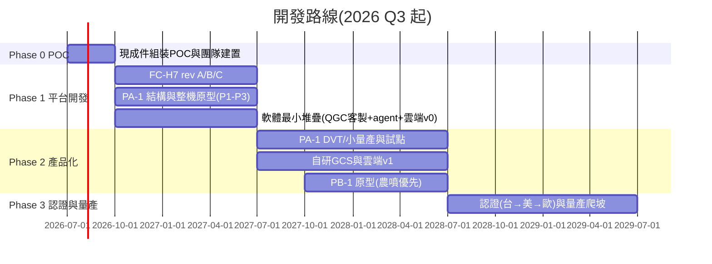

# 50-1 開發時程與里程碑

## 1. 總覽

## 2. 各階段內容與退出條件

### Phase 0 — 概念驗證(2026 Q3,3 個月,2–4 人)
- 用 **Holybro X500 V2 + Pixhawk 6X + Jetson Orin Nano 開發套件**組裝兩台開發機
- 跑通:PX4 任務飛行、uXRCE-DDS、QGC、簡單遙測上雲、ULog 分析腳本
- 同步:關鍵人員招募、供應商詢價、PA-1 詳細設計啟動
- **退出條件**:開發機自動任務飛行 20 架次無事故;PA-1 規格凍結(即本 repo 文件修訂為 rev 2)
- 詳細執行計畫見 [phase0/](phase0/README.md)

### Phase 1 — 平台開發(2026 Q4 – 2027 Q2,9 個月,6–8 人)
- FC-H7 三版迭代(見 flight-controller.md);全程 Pixhawk 6X 備援雙軌
- PA-1 結構 CNC 原型 P1(工程驗證)→ P2(功能全配)→ P3(環測機)
- 軟體:PX4 板級移植、obstacle_guard/precision_land/mission_exec v1、QGC 客製、雲端最小版
- **退出條件(= PA-1 EVT 完成)**:
  - P3 原型滿酬載懸停 35 min、8 km 鏈路、RTK 測繪成果精度達標
  - 失效保護全場景實測通過;累計 50 飛行小時
  - FC-H7 rev C 通過環測與 EMC 預掃

### Phase 2 — 產品化與試點(2027 Q3 – 2028 Q2,12 個月,10–15 人)
- PA-1:DVT(設計驗證測試)→ 小量產 10–20 台 → 3–5 個試點客戶(測繪公司、保全/公部門巡檢、電力)
- 自研 GCS v1、雲端 v1(任務派遣、影像、OTA)
- PB-1 原型:農噴構型優先(市場明確),物流構型跟隨
- **退出條件**:試點客戶付費續約 ≥ 2 家;PA-1 機隊 500 飛行小時、重大故障率達標;PB-1 滿載試飛完成

### Phase 3 — 認證與量產(2028 H2 起)
- 認證順序:台灣 → 美國(FCC+RID DoC)→ 歐盟(CE/C2)
- 量產:代工/自建產線決策、治具與產測系統、供應鏈雙源化
- PB-1 農噴上市;物流依法規開放度推進試點

## 3. 關鍵里程碑清單

| # | 里程碑 | 目標時間 |
|---|--------|----------|
| M1 | POC 開發機首飛 | 2026-08 |
| M2 | PA-1 規格凍結 | 2026-09 |
| M3 | FC-H7 rev A 點亮 + PX4 bring-up | 2027-01 |
| M4 | PA-1 P1 原型首飛(Pixhawk 備援板) | 2027-02 |
| M5 | PA-1 P2 搭載 FC-H7 rev B 首飛 | 2027-04 |
| M6 | PA-1 EVT 完成(Phase 1 退出) | 2027-06 |
| M7 | 首個付費試點客戶交機 | 2027-11 |
| M8 | PB-1 原型滿載首飛 | 2028-03 |
| M9 | PA-1 台灣合規銷售 + 美國 RID DoC | 2028-12 |

## 4. 風險登錄(Top 8)

| 風險 | 機率 | 衝擊 | 緩解 |
|------|------|------|------|
| FC-H7 延期(EMC/供料) | 高 | 中 | Pixhawk 6X 雙軌到 Phase 2;rev A 提早進 EMC 預掃 |
| 嵌入式/射頻人才招募慢 | 高 | 高 | Phase 0 就開缺;外包顧問補位;數傳不自研 |
| 續航/重量不達標 | 中 | 高 | 重量預算表週更;規格留 10% 餘裕;12S2P 定案後「容量上調」路已關([propulsion §7.3](../10-hardware/propulsion.md)),續航缺口以推力台實測效率買回或 M2 規格微調;倍率限流實測頻繁觸限則回 O1/O4 重議 |
| DJI 降價/禁令變化 | 中 | 高 | 錨定資料自主權客群;NDAA 供應鏈履歷做深 |
| 試點客戶轉化差 | 中 | 高 | Phase 1 就簽 LOI;產品委員會每季校準需求 |
| PB-1 大功率動力振動/可靠度 | 中 | 中 | 提前用 Hobbywing 整合動力做 mule 機驗證結構 |
| 電池認證卡關 | 低 | 中 | 選有 UN38.3 經驗的 pack 廠;提早送測 |
| 現金流(Phase 2 燒錢峰值) | 中 | 致命 | 里程碑式融資;PA-1 提早產生收入;政府補助(SBIR 等) |
