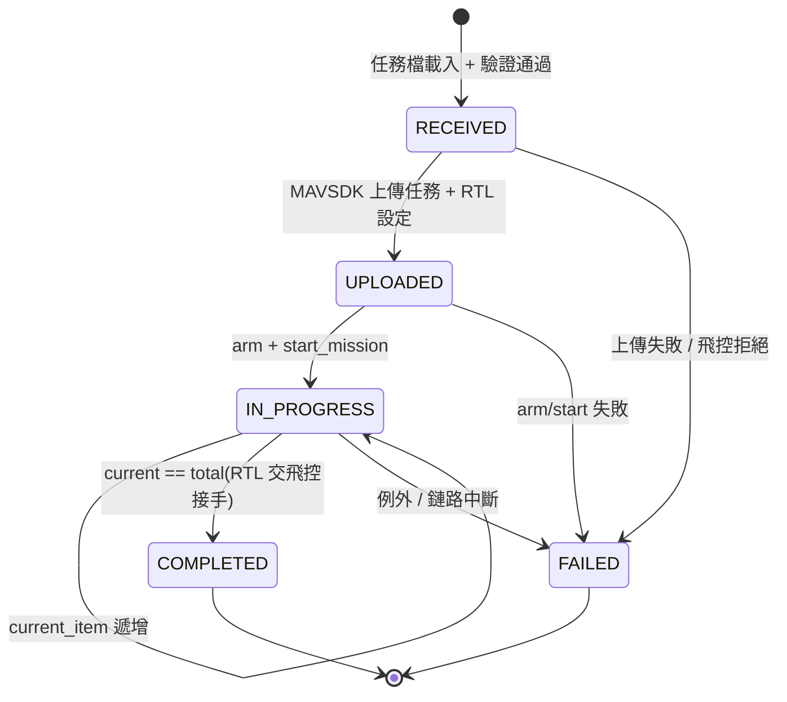

# mission_exec — 任務執行器(Phase 0 雛形)

> 對應規劃:[docs/20-software/companion-computer.md](../../docs/20-software/companion-computer.md)
> 的 mission_exec 模組(雲端任務 → MAVLink 任務轉譯、進度回報)。

接收 JSON 任務檔,經 MAVSDK 上傳 PX4 並執行,過程發布
[`drone.v1.MissionProgress`](../../interfaces/proto/drone/v1/mission.proto) 進度事件:

- **stdout 一定印**(每次狀態變化/航點推進一行)
- 有給 `--mqtt-host` 時同步發 MQTT 主題 `fleet/{drone_id}/mission/progress`(QoS 1,proto3 JSON)

## 任務檔格式

任務檔 = `drone.v1.MissionPlan` 的 **proto3 JSON mapping**,由
`google.protobuf.json_format.Parse` 解析,欄位天然受 proto 契約約束(未知欄位拒收)。
範例見 [missions/demo_square.json](missions/demo_square.json)(SITL 預設家點附近 ~100 m 方形
四航點,結束後 RTL):

```json
{
  "missionId": "demo-square-v1",
  "waypoints": [
    {"latDeg": 47.398642, "lonDeg": 8.545594, "relAltM": 20.0, "holdS": 0.0, "speedMs": 5.0}
  ],
  "rtlAfterLast": true
}
```

欄位映射(Waypoint → MAVSDK MissionItem):

| MissionPlan 欄位 | MissionItem | 備註 |
|---|---|---|
| `latDeg` / `lonDeg` | `latitude_deg` / `longitude_deg` | WGS84 |
| `relAltM` | `relative_altitude_m` | 相對起飛點 |
| `speedMs` | `speed_m_s` | 0 = 飛控預設(NaN) |
| `holdS` | `loiter_time_s` + `is_fly_through=False` | 0 = 直接通過(NaN / True) |
| `rtlAfterLast` | `set_return_to_launch_after_mission(True)` | 上傳後設定 |

相機/雲台欄位 Phase 0 不使用(`CameraAction.NONE` / `VehicleAction.NONE` / NaN)。

## 跑法

```bash
# 依賴(另需 proto 生成碼套件)
pip install -r requirements.txt
pip install -e ../../interfaces/proto/gen/python

# PX4 SITL(預設 udpin://0.0.0.0:14540)
python -m mission_exec.main --mission missions/demo_square.json --drone-id dev-1

# 指定連線與 MQTT 上報
python -m mission_exec.main --mission missions/demo_square.json \
    --url udpin://0.0.0.0:14540 --drone-id dev-1 \
    --mqtt-host localhost --mqtt-port 1883
```

測試:`pytest tests -q`

## 狀態機



任何例外都會先發出 `STATE_FAILED` 事件再拋出 `MissionExecError`(CLI exit code 1;
任務檔格式錯誤為 exit code 2)。
