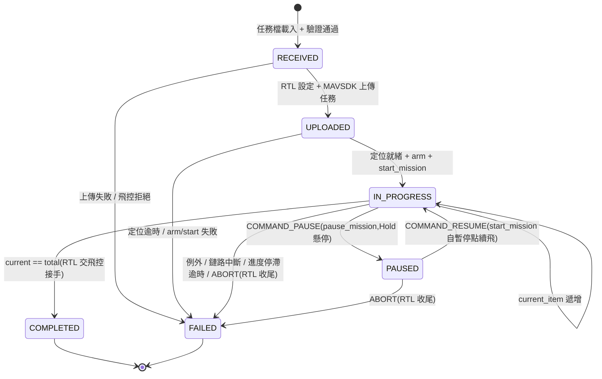

# mission_exec — 任務執行器(Phase 0 雛形)

> 對應規劃:[docs/20-software/companion-computer.md](../../docs/20-software/companion-computer.md)
> 的 mission_exec 模組(雲端任務 → MAVLink 任務轉譯、進度回報)。

接收 JSON 任務檔,經 MAVSDK 上傳 PX4 並執行,過程發布
[`drone.v1.MissionProgress`](../../interfaces/proto/drone/v1/mission.proto) 進度事件:

- **stdout 一定印**(每次狀態變化/航點推進一行)
- 有給 `--mqtt-host` 時同步發 MQTT 主題 `fleet/{drone_id}/mission/progress`(QoS 1,proto3 JSON)

## 任務檔格式

任務檔 = `drone.v1.MissionPlan` 的 **proto3 JSON mapping**,由
`google.protobuf.json_format.Parse` 解析,欄位天然受 proto 契約約束(未知欄位拒收)。
範例見 [missions/demo_square.json](missions/demo_square.json)(SITL 預設家點附近 ~100 m 方形
四航點,結束後 RTL):

```json
{
  "missionId": "demo-square-v1",
  "waypoints": [
    {"latDeg": 47.398642, "lonDeg": 8.545594, "relAltM": 20.0, "holdS": 0.0, "speedMs": 5.0}
  ],
  "rtlAfterLast": true
}
```

欄位映射(Waypoint → MAVSDK MissionItem):

| MissionPlan 欄位 | MissionItem | 備註 |
|---|---|---|
| `latDeg` / `lonDeg` | `latitude_deg` / `longitude_deg` | WGS84 |
| `relAltM` | `relative_altitude_m` | 相對起飛點 |
| `speedMs` | `speed_m_s` | 0 = 飛控預設(NaN) |
| `holdS` | `loiter_time_s` + `is_fly_through=False` | 0 = 直接通過(NaN / True) |
| `rtlAfterLast` | `set_return_to_launch_after_mission(True)` | **上傳前**設定(MAVSDK 僅對「下一次上傳」生效,上傳後才設完全無效) |

相機/雲台欄位 Phase 0 不使用(`CameraAction.NONE` / `VehicleAction.NONE` / NaN)。

## 航線產生器(S24:`mission_exec.patterns`)

純函式產生 `MissionPlan`(供 F05/F06 任務檔與 `tools/sitl_scenarios` f05–f08 預跑;
經緯度平移用平面近似,百公尺級誤差可忽略;產出皆過 `plan.validate_plan`):

- `survey_grid(center_lat, center_lon, width_m, height_m, spacing_m, alt_m, speed_ms)`:
  蛇行測繪網格——東西向航線、南→北堆疊,行距 = `spacing_m`
  (航線數 = ⌊height/spacing⌋+1,置中;每行 2 航點,偶數行向東、奇數行向西)。
- `corridor(start_lat, start_lon, heading_deg, length_m, leg_alts, speed_ms)`:
  直線走廊分段——沿 heading 均分 `len(leg_alts)` 段,每段一個高度
  (段首+段尾同高度 → 平飛段、段界垂直轉換;heading 0 = 正北、90 = 正東)。

兩者皆可用 keyword `mission_id=` 覆寫自動命名;`rtl_after_last` 由呼叫端自行設定。

## 跑法

```bash
# 安裝(S11 起為可安裝套件,依賴由 pyproject 帶入;drone-proto 為 repo 內
# 本地套件,需另行安裝)
pip install -e .
pip install -e ../../interfaces/proto/gen/python

# PX4 SITL(預設 udpin://0.0.0.0:14540)
python -m mission_exec.main --mission missions/demo_square.json --drone-id dev-1

# 指定連線與 MQTT 上報
python -m mission_exec.main --mission missions/demo_square.json \
    --url udpin://0.0.0.0:14540 --drone-id dev-1 \
    --mqtt-host localhost --mqtt-port 1883

# 連既有 mavsdk_server(不自行 spawn)
python -m mission_exec.main --mission missions/demo_square.json \
    --drone-id dev-1 --mavsdk-address localhost:50051
```

> 與 drone_agent 同機併跑時,用 `--mavsdk-address localhost:50051` 顯式共用同一個
> mavsdk_server,不要依賴隱性埠共用(兩個進程各自 spawn 會搶 MAVLink 埠)。

逾時參數(逾時皆發 `STATE_FAILED` 後以 exit code 1 結束):

- `--health-timeout`(預設 120 秒):上傳後等待 GPS/home 就緒的上限,逾時=「定位未就緒」。
- `--stall-timeout`(預設 300 秒):進度事件**停滯**上限——超過此時間**完全沒有任何**
  進度事件才判失敗(鏈路中斷/失效保護接管);航點間隔長不算停滯。

進度發布為 best-effort:MQTT broker 斷線只記 WARNING,不中斷任務(stdout 一定印)。

測試:`pytest tests -q`

## 狀態機



任何例外都會先發出 `STATE_FAILED` 事件再拋出 `MissionExecError`(CLI exit code 1;
任務檔格式錯誤為 exit code 2)。

## 任務控制(S23 已實作)

有給 `--mqtt-host` 時,任務執行期間同一條 MQTT 連線**直訂**
`fleet/{drone_id}/cmd/mission_ctrl`(QoS 1,`drone.v1.MissionCommand` proto3 JSON;
定義見 [interfaces/README.md](../../interfaces/README.md) 與
[mission.proto](../../interfaces/proto/drone/v1/mission.proto));
無 `--mqtt-host` 時控制通道自然停用。發送端:
`python tools/dispatch_mission.py --drone-id dev-1 --ctrl pause --mission-id <id>`。

| 命令 | 機上動作 | 進度事件 |
|------|---------|---------|
| `COMMAND_PAUSE` | `mission.pause_mission()`(Hold 懸停) | `STATE_PAUSED`(帶 current_item 斷點) |
| `COMMAND_RESUME` | `mission.start_mission()`(自暫停點續飛) | 回 `STATE_IN_PROGRESS` |
| `COMMAND_ABORT` | `action.return_to_launch()` 後結束(exit 1) | `STATE_FAILED`(契約無 ABORTED,以 FAILED 承載,log 註明 abort) |

語意細節:

- `mission_id` 不符當前任務、未知命令、狀態不符(未暫停收 RESUME、暫停中重複
  PAUSE)一律 log 後忽略(QoS 1 at-least-once,dup 常態);
- **PAUSED 期間 `--stall-timeout` 暫停計時**(暫停是合法靜止,不可被當停滯誤殺),
  RESUME 後重新起算;
- 控制通道為 best-effort:broker 斷線只停用控制,不中斷任務本體。

斷點續飛:`--resume N`(0-based)於上傳後 `set_current_mission_item(N)` 再
start,自航點 N 開始;斷點可由進度事件的 `current_item` 記錄(PAUSED / FAILED
事件皆帶)。
